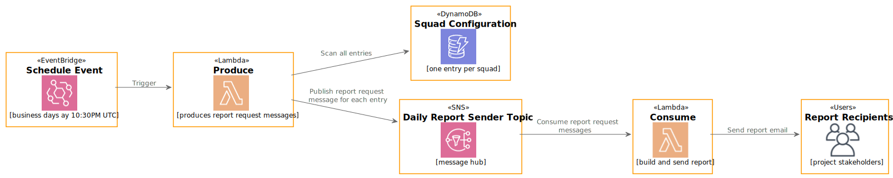

# 📄 Azure DevOps Sprint Daily Report Sender
[](https://github.com/jpmoura/azure-devops-sprint-daily-report/actions/workflows/main.yml)
[](https://sonarcloud.io/dashboard?id=jpmoura_azure-devops-sprint-daily-report)
[](https://sonarcloud.io/dashboard?id=jpmoura_azure-devops-sprint-daily-report)
[](https://sonarcloud.io/dashboard?id=jpmoura_azure-devops-sprint-daily-report)
[](https://sonarcloud.io/dashboard?id=jpmoura_azure-devops-sprint-daily-report)

This is an automatic serverless application that sends daily reports based on Azure DevOps information built using Node.js with TypeScript and powered by [Serverless Framework](https://www.serverless.com/). It consumes the [Azure DevOps API](https://docs.microsoft.com/en-us/rest/api/azure/devops/?view=azure-devops-rest-6.1) to gather all relevant information about the team's current iteration, format as HTML email and send it to a list of stakeholders, freeing the team time to focus on what really matters.

You can check a example report generated by the application in the [example report file](./examples/example.report.html).
## 1. Project architecture 🏠

This project uses clean code approach with repository pattern. The structure is the following:

```
|-\assets
|----\images
|----\templates
|-\inputs
|-\migrations
|----\seeds
|-\src
|----\domain
|--------\model
|--------\use-case
|----\infra
|--------\repository
|----\messaging
|----\use-case
```

There are only tow functions:

1. `Produce`: responsible to publish a message in application topic for each active entry in `SquadConfiguration` DynamoDB table
2. `Consume`: responsible to consume all published messages by `Produce` function, build and sending the report based on the squad configuration inside the message

Each directory will be discussed in the following subsections.

### 1.1 `assets` directory
Contains all images and [Eta](https://github.com/eta-dev/eta) templates in respective folders.

The project templates are in brazilian portuguese but feel free to adapt the templates according your needs.

### 1.2 `inputs` directory
Contains inputs for local invocation of all functions.

### 1.3 `migrations` directory
Contains a `seed` subdirectory which has all seed files for all DynamoDB tables used in the application.

### 1.4 `src` directory
Contains all source files separated by responsibilities like `domain`, `infra` and `use-case`

1. `domain`: contains all interfaces used across the application
2. `infra`: contains all data repositories at this point
3. `messaging`: contains all handlers that consumes or produces messages for asynchronous communication/integration
4. `use-case`: contains all business logic like building the e-mail HTML, fetching the current iteration data and sending e-mail

### 1.5 Big Picture



## 2. Environment Configuration 🔧

A example of a stage `.env` should be:

```
SNS_SQS_PREFIX="yourstagename-daily-report"
DYNAMO_TABLE_PREFIX="YourStageName.DailyReport"
```

For a local stage a.k.a. debug, just create a `.env.local` with the following content:
```
SLS_DEBUG=*
AWS_REGION="local"
AWS_ACCESS_KEY_ID="fake-acess-key-id"
AWS_SECRET_ACCESS_KEY="fake-secret-access-key"
DYNAMO_TABLE_PREFIX="Local.DailyReport"
DYNAMO_PREFIX_ENDPOINT="http://localhost:7000"
SNS_ENDPOINT="http://localhost:7001"
SNS_SQS_PREFIX="local-daily-report"
```

Remember to set all SMTP info correctly so the application will not be able to send the report.

If you want a debug behavior just insert the entry `SLS_DEBUG=*` or remove it otherwise.

For convenience there is a the [`.env.example`](.env.example) already in this repo.

The model used for squad configuration table follows the schema:

```json
{
  "id": "a-random-uuid",
  "email": {
    "authentication": {
      "user": "user@provider.com",
      "password": "secret"
    },
    "server": {
      "host": "smtp.provider.com",
      "port": 587
    },
    "recipients": [
      "business-owner@company.com", "product-owner@company.com"
    ],
    "carbonCopyRecipients": [
      "tech-lead@devteam.com", "a-dev@devteam.com", "another-dev@devteam.com"
    ]
  },
  "azureDevOps": {
    "authentication": {
      "pat": "a-personal-access-token-with-privileges-to-read-data-from-azure",
      // User and Password are required only if the team uses a burndown with custom measurement
      "user": "dev-with-access-a-azure-devops@devteam.com",
      "password": "secret"
    },
    "organization": "Company",
    "project": "Super Secret App",
    "team": "Super Secret App Team",
    "hasCustomBurndown": true // If the burndown relies in a measurement other than remaining work then this property should be true
  },
  "isActive": true
}
```

`azureDevOps.authentication.user` and `azureDevOps.authentication.password` are only required if `isActive` is equals `true`. These properties are necessary to log in at Azure DevOps, navigate to current iteration page and screenshot the burndown chart.

`email.carbonCopyRecipients` is optional.

## 3. Run 🏃‍♂️

After setting the `.env.local` file just run the command `yarn` to install all dependency packages and after it finished run `yarn start` or for short `yarn && yarn start`.

From version 1.0, this application aims to be executed in the cloud (AWS) but you can also run programmatically by invoking the `debug:consume` command with a proper set [`consume.json`](./inputs/consume.json) input file.

### 3.1 Debug 🐛
If you are using Windows as platform will be necessary to install the Serverless framework globally using the command `yarn global add serverless`.

If you use Visual Code Studio all the launch parameters are already configured in [`launch.json`](./.vscode/launch.json).

Also, if you are debugging in a UNIX platform you will need to install all puppeteer [UNIX dependency packages](https://github.com/puppeteer/puppeteer/blob/main/docs/troubleshooting.md#chrome-headless-doesnt-launch-on-unix).
